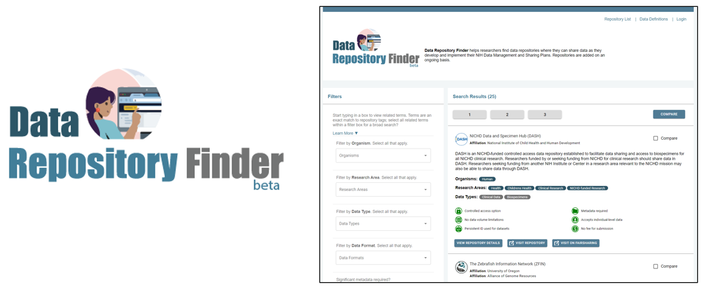

#### Library Main Navigation: &nbsp; &nbsp;  [Ecosystem Use Case Library Home](https://github.com/NIH-NICHD-Ecosystem) &nbsp; | &nbsp;[User Stories](https://github.com/NIH-NICHD-Ecosystem/UserStories/blob/main/README.md)  &nbsp; | &nbsp; [Use Cases](https://github.com/NIH-NICHD-Ecosystem/UseCases/blob/main/README.md) &nbsp; | &nbsp; [Efforts](https://github.com/NIH-NICHD-Ecosystem/Efforts/blob/main/README.md) &nbsp; | &nbsp; [Library Help](https://github.com/NIH-NICHD-Ecosystem/LibraryHelp/blob/main/README.md)

 

# E1: Data Repository Finder

  
 
 

### The Data Repository Finder is an open-access, web-based tool that helps NICHD researchers find data repositories where they can share data as they develop and implement their NIH Data Management and Sharing Plans. Repositories are added on an ongoing basis.

### > Live in Beta. Visit the website at https://data-repository-finder.ll.mit.edu*
*\*External link, NIH is not responsible for content of external sites*
   

## Effort Overview 

 Recognizing the need for researchers to find and use data repositories that address their specific data needs, NICHD developed a  tool to display information researchers need to complete their Data Management and Sharing Plans when applying for NICHD funding. Information is manually extracted from the websites of repositories identified by NICHD's Office of Data Science and Sharing (ODSS) and includes details such as what data access tiers the repository supports and  data submission requirements. 

#### Primary contact:  [Data-Repository-Finder-Support@ll.mit.edu](mailto:Data-Repository-Finder-Support@ll.mit.edu?subject=Data-Repository-Finder-Support) 

#### Details: 
* <b> Built by:</b> MIT Lincoln Laboratory in REACT 
* <b> Hosted by:</b> MIT Lincoln Laboratory in their public AWS cloud environment 
* <b> Sponsor contact:</b> Dr. Rebecca Rosen, Director of NICHD ODSS
  

## Effort Scope

### [> Effort Documentation](https://github.com/NIH-NICHD-Ecosystem/E1_Data-Repository-Finder/blob/main/Documentation/Use-Cases-Overview.md) 

### Related Use Cases and User Stories

| UC# | Use Case  |  User Story    | 
| :--------|:------------------------------- | :------------------------------- | 
| UC1.1 | [Add repository](https://github.com/NIH-NICHD-Ecosystem/E1_Data-Repository-Finder/blob/main/Documentation/1_Use-Cases/Pages/UC1.1_Add-Repository.md) | <ul><li>(enabling functionality)</li></ul>
| UC1.2 | [Publish repository](https://github.com/NIH-NICHD-Ecosystem/E1_Data-Repository-Finder/blob/main/Documentation/1_Use-Cases/Pages/UC1.2-PublishRepository.md) | <ul><li>(enabling functionality)</li></ul>
| UC1.3 | [Edit Repository](https://github.com/NIH-NICHD-Ecosystem/E1_Data-Repository-Finder/blob/main/Documentation/1_Use-Cases/Pages/UC1.3-EditRepository.md) |  <ul><li>[S3: As NICHD staff, I want to be able to update a given field in the Data Repository Finder and track the date and reason for  the change, so that I can go back later and review why that decision was made ](https://github.com/NIH-NICHD-Ecosystem/UserStories/blob/main/stories/storyID-3.md) </li></ul>
| UC1.4 | [View Provenance](https://github.com/NIH-NICHD-Ecosystem/E1_Data-Repository-Finder/blob/main/Documentation/1_Use-Cases/Pages/UC1.4-ViewProvenance.md) | <ul><li>[S3: As NICHD staff, I want to be able to update a given field in the Data Repository Finder and track the date and reason for  the change, so that I can go back later and review why that decision was made ](https://github.com/NIH-NICHD-Ecosystem/UserStories/blob/main/stories/storyID-3.md) </li></ul>
| UC1.5 | [Identify Repository](https://github.com/NIH-NICHD-Ecosystem/E1_Data-Repository-Finder/blob/main/Documentation/1_Use-Cases/Pages/UC1.5-IdentifyRepository.md) | <ul><li> [S30: As an NICHD researcher, I want to find the best data repositories for the sharing scientific data that I am generating in my project and understand the repository 's submission and sharing practices so  I can complete my Data Management and Sharing Plan](https://github.com/NIH-NICHD-Ecosystem/UserStories/blob/main/stories/storyID-30.md) </li></ul><ul><li> [S31: As an NICHD program officer, I want to verify that researchers are using data repositories appropriate for the scientific data they plan to share and that their DMS Plan is consistent with the repository's expectations and requirements.](https://github.com/NIH-NICHD-Ecosystem/UserStories/blob/main/stories/storyID-31.md) </li></ul>

 

